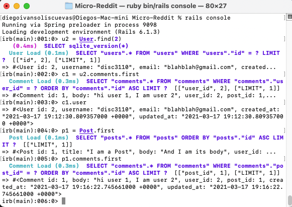

# Micro-Reddit

> This is a solution to the [Odin project lesson: Micro-Reddit](https://www.theodinproject.com/courses/ruby-on-rails/lessons/building-with-active-record-ruby-on-rails). 

## Built With

- Ruby on Rails
- Ruby

## Getting Started 

- Run this command in your OS terminal: `git clone https://github.com/disc3110/Miro-reddit.git` to get a copy of the project.
- Open a terminal in the project folder and run `rails console`.

### Prerequisites

* Internet connection
* Having Ruby installed on you OS
* Having Rails installed on your OS

### Description

This programm is made to interect through users via comments and posts. If you want to create a new user you can use `u1 = User.new(username: 'xxxx', email'xxxxx')` and the same syntaxis for Post or Comments.

## Authors

👤 **Author1**

- GitHub: [disc3110](https://github.com/disc3110)
- Twitter: [Diego Ivan Solis](https://twitter.com/disc3110)

👤 **Author2**

- GitHub: [kimothokamau](https://github.com/kimothokamau)
- Twitter: [kimothokk](https://twitter.com/kimothokk)

## 🤝 Contributing

Contributions, issues, and feature requests are welcome!

Feel free to check the [issues page](https://github.com/disc3110/Miro-reddit/issues).

## Show your support

Give a ⭐️ if you like this project!

## Acknowledgments

- To developers, Microverse, ruby official guidelines and The odin Project

## 📝 License

This project is [MIT](https://es.wikipedia.org/wiki/Licencia_MIT) licensed.